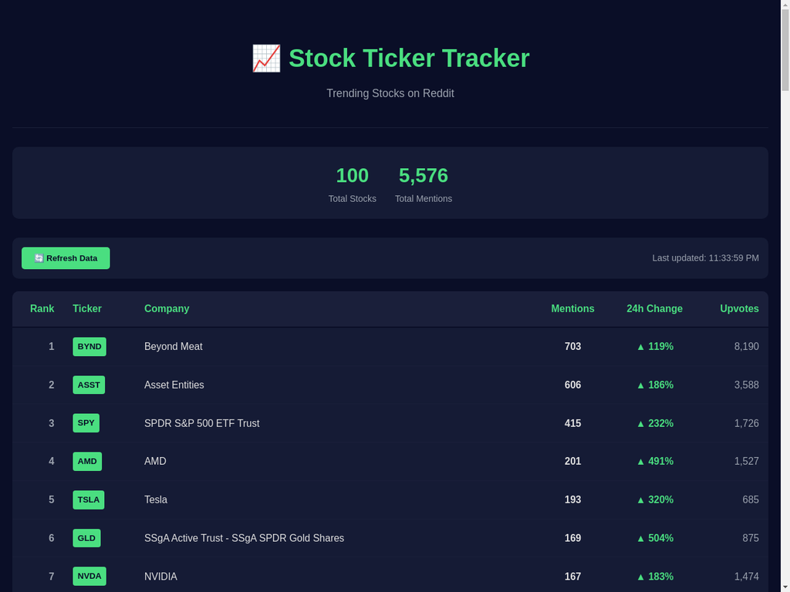

# 📈 Stock Ticker Tracker

A real-time social sentiment tracker that shows the most-talked-about stocks on Reddit, ranked by mentions across popular investing communities like r/wallstreetbets.



## 🚀 Features

- **Real-time Reddit tracking** - Monitor stock mentions across 15+ subreddits
- **Live updates** - Auto-refreshes every 5 minutes
- **24-hour change tracking** - See which stocks are gaining momentum
- **Clean, responsive design** - Works on desktop and mobile
- **Embeddable widget** - Easy to integrate into any website via iframe
- **Zero cost** - Uses free Apewisdom API (no API key required)

## 🎯 What It Tracks

The tracker monitors mentions from these Reddit communities:
- r/wallstreetbets
- r/stocks
- r/investing
- r/options
- r/pennystocks
- And 10+ more investing subreddits

## 🛠️ Tech Stack

- **Backend**: Node.js + Express
- **Frontend**: Vanilla JavaScript (no frameworks)
- **API**: Apewisdom API (free, no authentication)
- **Styling**: Custom CSS with dark theme

## 📦 Installation

### Prerequisites

- Node.js 14+ installed
- npm or yarn

### Setup

1. Clone the repository:
```bash
git clone https://github.com/yourusername/stock-ticker-tracker.git
cd stock-ticker-tracker
```

2. Install dependencies:
```bash
npm install
```

3. Start the server:
```bash
npm start
```

4. Open your browser to:
```
http://localhost:3000
```

## 🚀 Deployment

### Deploy to Render (Free)

1. Push your code to GitHub
2. Go to [render.com](https://render.com) and sign up
3. Click "New +" → "Web Service"
4. Connect your GitHub repository
5. Use these settings:
   - **Build Command**: `npm install`
   - **Start Command**: `npm start`
6. Click "Create Web Service"

### Deploy to Railway (Free)

1. Push your code to GitHub
2. Go to [railway.app](https://railway.app) and sign up
3. Click "New Project" → "Deploy from GitHub repo"
4. Select your repository
5. Railway will auto-detect and deploy

### Deploy to Vercel (Free)

Note: Vercel requires serverless functions. Use Render or Railway for easier deployment.

## 🎨 Embedding

To embed the tracker on your website:

```html
<iframe 
  src="https://your-deployed-url.com" 
  width="100%" 
  height="800px" 
  frameborder="0"
  style="border-radius: 10px;">
</iframe>
```

## 📊 API Endpoints

### GET `/api/stocks`

Returns the current top 100 trending stocks.

**Response:**
```json
{
  "count": 100,
  "pages": 9,
  "current_page": 1,
  "results": [
    {
      "rank": 1,
      "ticker": "TSLA",
      "name": "Tesla",
      "mentions": 450,
      "upvotes": 2500,
      "rank_24h_ago": 3,
      "mentions_24h_ago": 200
    }
  ]
}
```

## 🔧 Configuration

Edit `server.js` to customize:

- **Cache duration**: Change `CACHE_DURATION` (default: 5 minutes)
- **Port**: Change `PORT` environment variable (default: 3000)
- **Auto-refresh interval**: Edit `setInterval` in `public/index.html` (default: 5 minutes)

## 📝 Project Structure

```
stock-ticker-tracker/
├── server.js           # Express backend server
├── package.json        # Dependencies and scripts
├── public/
│   └── index.html     # Frontend application
├── README.md          # This file
└── .gitignore         # Git ignore rules
```

## 🤝 Contributing

Contributions are welcome! Please feel free to submit a Pull Request.

## 📄 License

MIT License - feel free to use this project for personal or commercial purposes.

## 🙏 Credits

- Data provided by [Apewisdom API](https://apewisdom.io/api/)
- Built with ❤️ for the retail investing community

## 📧 Support

For issues or questions, please open an issue on GitHub.

---

**Disclaimer**: This tool is for informational purposes only. Stock mentions do not constitute investment advice. Always do your own research before making investment decisions.

